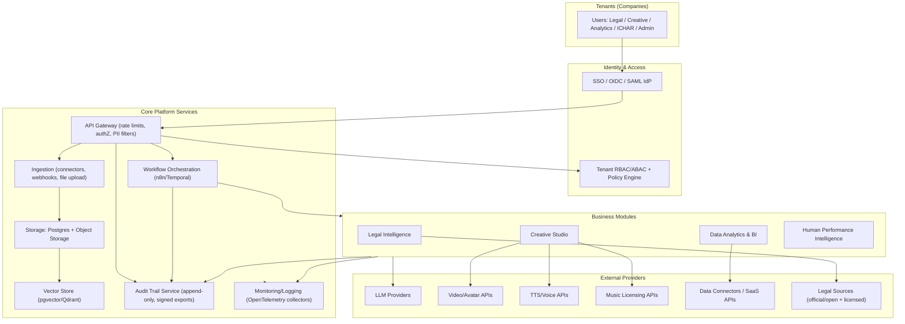
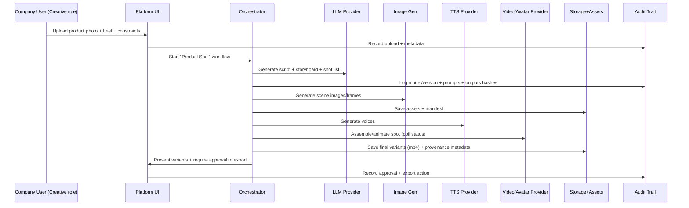
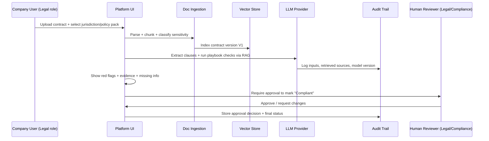
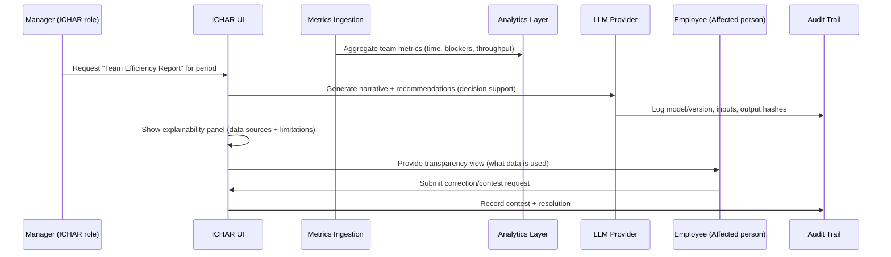

# Modular Enterprise AI Platform With Role-Based Modules: Legal Intelligence, Creative Studio, Data Analytics, and Human Performance Intelligence (ICHAR)

## Executive summary

You are proposing a multi-tenant, modular platform that gives companies “AI utilities” through APIs, while enforcing strict role separation: Legal Intelligence, Creative Image/Video Maker, Data Analytics/Business Intelligence, and Human Performance Intelligence (ICHAR). This is feasible, but the riskiest module is ICHAR: under the EU AI Act, AI used to **monitor/evaluate workers** and to make decisions affecting work relationships is explicitly treated as **high-risk** (Annex III — employment/workers management). citeturn12view1turn12view2turn12view3

Two implications follow:

- You must design the platform so customers can **prove compliance**: audit trail, versioned policies, human oversight, and worker transparency (including workplace information duties), plus AI literacy training obligations. citeturn10search2turn7search2turn25view3  
- “Disclaimers” (especially in Legal) reduce UX risk and manage expectations, but they do **not** eliminate regulatory exposure (GDPR/AI Act) or product-liability exposure when your software causes foreseeable harm. In particular, the EU Product Liability Directive explicitly treats **software (including SaaS)** as a “product” for strict liability purposes, and it makes clear it applies to products placed on the market/put into service after **9 December 2026** (with transposition by that same date). citeturn18view3turn18view2turn18view1

A safe, scalable implementation pattern is:

- **One platform foundation** (identity, RBAC/ABAC, tenant isolation, observability, audit trail, secure storage, orchestration) shared by all modules.
- **Module-level governance envelopes**: each module has its own risk gates, retention policies, escalation paths, and “allowed automations”.
- **Evidence-first UX** for Legal and ICHAR: outputs must be explainable, attributable, reviewable, and exportable for forensics.

The rest of this report turns that into a concrete build plan: requirements, compliant UX patterns, provider/API choices, cost ranges, a modular architecture proposal (with Mermaid diagram), three end-to-end flows, an audit trail data model, and an MVP→Beta→GA roadmap with success metrics.

## Scope, assumptions, and success criteria

### What is explicitly **unspecified** (must be decided before GA)

| Decision area | Why it matters | Status |
|---|---|---|
| Target customer profile (SMB vs mid-market vs enterprise; regulated industries) | Drives SSO needs, audit depth, procurement (DPA/SLA), and default retention | **Unspecified** |
| Primary deployment region (EU-only? Italy-first? global?) | Determines data residency, subprocessors, cross-border transfer posture | **Unspecified** |
| Hosting model (SaaS only vs SaaS + on-prem / VPC) | Determines architecture complexity and enterprise salesability | **Unspecified** |
| Budget for model usage and creative rendering (monthly) | Determines whether to use premium models, caching, gating | **Unspecified** |
| Whether ICHAR will be used for “recommendations” only vs employment decisions | Determines GDPR Art. 22 exposure and AI Act high-risk posture | **Unspecified** |
| Supported source systems (ERP/CRM/HRIS/e-commerce) | Determines your connector strategy and integration costs | **Unspecified** |
| Security posture targets (ISO 27001, SOC 2, etc.) | Affects roadmap and vendor choices | **Unspecified** |
| Legal content licensing strategy (official sources only vs premium publishers) | Impacts accuracy, jurisdiction coverage, and cost | **Unspecified** |

### Practical success criteria (recommended)

- **Tenant isolation provably correct**: no cross-tenant data leakage under adversarial testing (RLS + application-layer controls + secrets separation). citeturn19search2turn4search3  
- **Auditability**: every AI-generated output is traceable to (a) inputs, (b) model/provider/version, (c) retrieved sources, (d) human approvals, (e) policies in effect. citeturn0search0turn24view3  
- **Regulatory readiness for ICHAR**: feature set avoids prohibited HR practices (e.g., emotion inference in the workplace) and supports high-risk obligations when applicable (logging, worker information, oversight). citeturn25view3turn12view1turn0search1  
- **Commercial viability**: MVP can ship value in <12 weeks with a limited number of connectors and workflows, while keeping legal/HR outputs “assistive” rather than autonomous.

## Core platform foundations

### Regulatory baselines that shape the platform design

- **GDPR**: you will process personal data in all four modules (at minimum user identity + activity logs; often far more). GDPR stresses data protection by design/default and risk-based measures. citeturn13view1turn7search0  
- **GDPR automated decision-making**: where you process personal data for automated decision-making/profiling, GDPR requires transparency about “the logic involved” and consequences, and imposes constraints on solely automated decisions with significant effects (Art. 22 context). citeturn13view0turn15view0  
- **EU AI Act**:  
  - Transparency obligations when AI interacts with people (and marking of synthetic outputs in machine-readable/detectable form). citeturn24view3turn24view1  
  - AI literacy obligations for providers/deployers. citeturn10search2turn7search2turn10search8  
  - High-risk domain coverage explicitly includes employment/workers management (including monitoring/evaluating performance). citeturn12view1turn12view2turn12view3  
  - Workplace-specific: emotion inference in workplace contexts is prohibited (except medical/safety), and employers must inform workers/representatives before using a high-risk AI system at work. citeturn25view3turn12view2  
- **EU Product Liability Directive (new PLD)**: software is treated as a product; SaaS is explicitly within scope; applies to products placed on the market/put into service after 9 Dec 2026, and Member States must transpose by that date. citeturn18view3turn18view2turn18view1

### Platform architecture components

You should treat the platform as five cross-cutting layers plus four modules:

- **Identity & Access layer**: SSO/OIDC/SAML; tenant-aware RBAC; optionally ABAC attributes (department, region, role, seniority).
- **Orchestration layer**: workflow engine for long-running, multi-step automations (creative spots, legal reviews, ETL schedules).
- **Ingestion layer**: connectors and pipelines (files, APIs, webhooks), including change detection + incremental updates.
- **Storage layer**: operational DB, object storage, and a vector store for retrieval-augmented generation (RAG).
- **Logging/monitoring layer**: centralized telemetry, security logs, model cost tracking, and audit trail exports.

### Recommended provider and stack shortlist

The table below is a *toolbox*, not a commitment. It prioritizes official/primary providers and EU-forward options where they exist.

| Capability area | Recommended options (shortlist) | Notes / why it’s on the list |
|---|---|---|
| Identity / SSO | entity["organization","Keycloak","oss iam server"], entity["company","ZITADEL","ciam provider"] | Keycloak supports OIDC/SAML standards. citeturn3search3turn3search9 ZITADEL offers cloud availability including EU + pricing tiers. citeturn4search0turn4search4turn4search8 |
| Low-code workflow automation | entity["company","n8n","workflow automation"] | Strong for MVP: fast iteration, integrations, self-host option; pricing and EU hosting are documented. citeturn22view0 |
| Durable, code-first orchestration | entity["organization","Temporal","durable workflow engine"] | For GA-grade long-running workflows with retries and history; explicit “workflow execution” concept. citeturn3search5turn3search2 |
| Operational backend (DB/Auth/Storage/Functions) | entity["company","Supabase","postgres baas"] | Useful for MVP speed: Postgres + storage + edge functions + RLS patterns. citeturn19search13turn19search2turn19search29 |
| Vector store | entity["organization","pgvector","postgres vector extension"], entity["company","Qdrant","vector database"] | pgvector keeps vectors “in Postgres”; Qdrant offers managed cloud with free tier and pay-as-you-go. citeturn4search3turn4search5turn4search1 |
| BI / embedded analytics | entity["company","Metabase","business intelligence platform"] | Row/column security is Pro/Enterprise; pricing and embedding capabilities are documented. citeturn23search6turn23search3turn23search0 |
| ELT / connectors | entity["company","Airbyte","data integration"], entity["company","Fivetran","data integration"] | Airbyte pricing via credits; Fivetran has 2026 pricing changes + min connection charge. citeturn5search2turn5search3turn5search36 |
| Observability standard | entity["organization","OpenTelemetry","observability framework"] | Vendor-neutral traces/metrics/logs; stable spec and log data model. citeturn5search0turn5search29 |
| Container orchestration | entity["organization","Kubernetes","container orchestration"] | Standard for scaling self-hosted deployments. citeturn5search1turn5search5 |
| LLM app framework | entity["organization","LangChain","llm app framework"], entity["company","LlamaIndex","rag framework"] | Both have strong RAG and tooling docs. citeturn6search4turn6search7turn6search3 |
| LLM observability (optional) | entity["company","LangSmith","llm observability"] | Tracing + cost tracking; note data governance implications. citeturn6search0turn6search33turn6search2 |
| Document parsing (optional) | entity["company","LlamaParse","document parsing api"] | Pricing and API v2 guide are explicit; useful for complex PDFs/scans. citeturn6search1turn6search18turn6search5 |
| LLM provider options | entity["company","OpenAI","ai model provider"], entity["company","Mistral AI","eu ai model provider"] | OpenAI: Responses API direction + data controls + EU data residency pages. citeturn19search0turn19search1turn1search2turn19search8 Mistral: default EU hosting + published pricing for some models. citeturn20search2turn20search0 |
| Creative video | entity["company","HeyGen","ai video generation"] | Official API docs + pricing; includes consent statement for digital twin workflows. citeturn2search32turn2search25turn2search24 |
| Voice synthesis | entity["company","ElevenLabs","text to speech"] | Official pricing + TTS docs + multilingual support. citeturn2search2turn2search6 |
| Stock music / licensing + API | entity["company","Artlist","music licensing"] | Enterprise API authentication docs + license PDF (important for rights). citeturn2search39turn2search31turn2search11 |
| Legal content (premium) | entity["company","Wolters Kluwer","legal publisher"], entity["company","Giuffrè Francis Lefebvre","legal publisher italy"], entity["company","vLex","legal intelligence provider"] | These offer AI-enabled legal products and/or developer APIs; API access is typically contract-based. citeturn8search0turn8search1turn8search6turn8search2 |
| Official legal sources / open data | entity["organization","EUR-Lex","eu law portal"], entity["organization","Publications Office of the European Union","eu publications office"], entity["organization","Cellar","eu semantic repository"], entity["organization","Normattiva","italian legislation portal"], entity["organization","Istituto Poligrafico e Zecca dello Stato","italian state printing"] | EUR-Lex reuse includes SPARQL + REST via Cellar; Cellar developer docs exist. citeturn9search0turn9search1 Normattiva Open Data includes APIs + docs and is backed by IPZS. citeturn9search3turn9search28turn8search15 |
| EU regulatory bodies referenced | entity["organization","European Commission","eu executive body"], entity["organization","European Data Protection Board","eu data protection board"] | Primary sources for AI Act guidance/FAQs and GDPR guidance. citeturn7search5turn7search2turn14view0 |

### Proposed modular architecture (Mermaid)

This architecture is consistent with (a) AI Act expectations around logging and transparency, and (b) GDPR’s “data protection by design/default” posture. citeturn0search0turn24view3turn13view1

### Audit trail and versioning: platform-wide specification

#### Why this is non-negotiable

- The AI Act expects automatic logging capabilities for certain systems and deployer-side log retention for high-risk use. citeturn0search0turn0search1  
- GDPR accountability + the practical reality of AI hallucinations means you need evidentiary traces. Real-world incidents show legal professionals were sanctioned for filing AI-fabricated cases; your product must make that kind of failure both less likely and provable when it happens. citeturn21search0turn21search1

#### Audit trail canonical event model (store these fields)

A pragmatic event schema (in Postgres) for each “meaningful action” (AI run, document upload, approval, export, policy change):

| Field group | Fields (minimum) | Notes |
|---|---|---|
| Identity & tenancy | `event_id` (UUID), `tenant_id`, `org_unit_id`, `actor_type` (user/service), `actor_id`, `role_snapshot`, `ip`, `user_agent` | Store **role snapshot** so you can prove permissions at time of action. |
| Time & correlation | `occurred_at`, `request_id`, `session_id`, `workflow_run_id`, `span_id` | Map to OpenTelemetry traces for end-to-end observability. citeturn5search0turn5search29 |
| Action metadata | `module` (legal/creative/bi/ichar), `action_type`, `object_type` (doc/report/asset), `object_id`, `environment` (dev/stage/prod) | Supports forensics + environment separation. |
| Inputs | `input_ref` (object storage pointer), `input_hash_sha256`, `input_redaction_map`, `input_classification` (PII/special category/confidential) | Prefer storing large inputs as encrypted objects; store hashes in DB. |
| Model & tools | `model_provider`, `model_name`, `model_version`, `tool_calls[]`, `tool_versions[]` | Critical for reproducibility; OpenAI has deprecation schedules. citeturn19search8turn19search0 |
| Retrieval context (RAG) | `retrieval_query`, `retrieved_doc_ids[]`, `retrieved_doc_versions[]`, `retrieval_scores[]` | Mandatory for Legal credibility. |
| Outputs | `output_ref`, `output_hash_sha256`, `safety_flags[]`, `quality_score`, `human_readable_summary` | Store “user-facing output” separately from raw traces for least-privilege access. |
| Human oversight | `review_required` (bool), `review_status`, `reviewer_id`, `review_notes`, `approval_timestamp` | Essential for GDPR Art. 22 risk control and AI Act high-risk governance. citeturn13view0turn12view1 |
| Cost & performance | `latency_ms`, `tokens_in/out`, `provider_cost_estimate`, `cache_hit` | Needed for unit economics and rate limiting. citeturn6search33 |
| Policy & versioning | `policy_pack_id`, `policy_pack_version`, `prompt_template_version`, `workflow_definition_version` | Enables “what rules were in effect when this output was produced”. |
| Integrity & export | `prev_event_hash`, `event_hash`, `signature_id`, `export_batch_id` | Build a tamper-evident hash chain per tenant/workspace. |

#### Retention recommendations (risk-tiered)

- **Baseline**: keep full audit events (hashes + metadata) for **12–24 months**, with configurable tenant policy; keep large raw content shorter unless required. This balances GDPR minimization with operational needs. citeturn13view1turn13view2  
- **High-risk AI (ICHAR likely)**: ensure logs are retained **at least 6 months** where the customer has control of logs (AI Act deployer obligation). citeturn0search1  
- **Security logs**: 12 months (typical SOC practice) unless your customers impose longer.

#### Export formats for forensics (recommended)

- **JSON Lines (JSONL)**: one event per line + separate binary objects referenced by hash (easy for SIEM).
- **Parquet**: efficient for large-scale analytics (BI/security teams).
- **OTLP-compatible export** (OpenTelemetry collector pipeline) for traces/metrics/log correlation. citeturn5search0turn5search29  
- **Signed manifest**: `manifest.json` containing batch hashes + signature, stored in immutable/WORM storage if available.

## Legal Intelligence module

### Functional requirements

The Legal module should be explicitly positioned as **legal operations support** and **compliance assistance**, not a substitute for qualified counsel.

Core capabilities:

1. **Legal Q&A with citation grounding**  
   - Must return “answer + sources + quoted excerpts + jurisdiction/date context”.  
   - Must allow “show evidence” mode as the default view for non-trivial questions (contracts, employment, regulated domains).  
2. **Contract review / compliance check**  
   - Clause extraction and normalization (e.g., termination, warranty, indemnity, DPA clauses).  
   - Playbooks: “required clauses” by template/jurisdiction/customer policy.  
3. **Red flag detection + escalation**  
   - If confidence is low, sources conflict, or context is incomplete, the tool should explicitly request human review and generate a review brief.  
4. **Regulatory monitoring**  
   - Track change events for legal sources; surface diffs and impacted internal policies.  
5. **Source management & versioning**  
   - Every answer is tied to a specific corpus version (“as of date/time”).  
6. **Multi-lingual workflows** (at least Italian and English): writing, summarizing, and explaining to non-lawyers.

### Regulatory and legal requirements

#### GDPR risk points

- Legal documents often contain personal data (names, signatures, sometimes special categories). You need: encryption at rest/in transit, least privilege, strict tenant isolation, and scoped retention. citeturn13view1turn13view2  

#### AI Act transparency obligations (practical impact)

- If the module is an AI system interacting with natural persons, users must be informed they are interacting with AI (unless obvious). citeturn24view3  
- If the module generates synthetic text derived from AI, your platform should support labeling/marking obligations where applicable (especially if outputs are republished externally). citeturn24view1turn7search1  

#### Product liability posture

- Because software (including SaaS) is expressly considered a product under the new EU PLD, your Legal module must be developed with a “foreseeable misuse” mindset: if users rely on it in a way your UX reasonably enables, that can become a liability story. citeturn18view3turn18view1  

### Secure UX patterns for the Legal module (must-have)

These are patterns that reduce harm more reliably than “we disclaim liability” banners:

1. **Two-pane “answer + sources” layout (default)**  
   - Left: structured answer.  
   - Right: sources list (official texts, contract snippets, internal policy docs) with timestamps and exact passage anchors.  
2. **Mandatory “jurisdiction + purpose” selector**  
   - Example: “Italy / EU-wide / other”, and “internal policy check / contract red-flag / research memo / client email draft”.  
   - This reduces accidental cross-jurisdiction hallucinations.  
3. **Confidence is not a scalar—use a *coverage model***  
   - Coverage indicators: “sources found”, “sources conflict”, “source recency”, “missing inputs”, “requires lawyer review”.  
4. **No “final answer” without citations for any legal claim**  
   - If the system can’t cite sources, it must switch to “draft questions for counsel” mode.  
5. **Hard blocks for forbidden behaviors**  
   - “Generate a court filing with citations” → forced review mode + require user attestation they will verify citations.  
   - The rationale is not theoretical: lawyers have been sanctioned for filing AI-fabricated cases. citeturn21search0turn21search1  
6. **“Export for counsel” button**  
   - Exports: sources bundle + clause map + versioned playbook + your audit record IDs.  
7. **Human-in-the-loop workflow templates**  
   - For contract compliance: require a “reviewer approval” to mark a contract as “compliant” in system-of-record.

### Recommended APIs/providers and rationale (Legal)

#### Official/open legal sources (EU/Italy-first)

- **EU law & metadata**: EUR-Lex reuse mechanisms include access via **Cellar** SPARQL endpoint + REST API to retrieve metadata/notices and download content. citeturn9search0turn9search1turn9search22  
- **Italian legislation**: Normattiva Open Data provides a portal and API documentation (including test environment and export formats). citeturn9search3turn9search6turn8search17turn9search28  

Rationale: official sources reduce citation risk, reduce licensing entanglement, and align with the “evidence-first” UX requirement.

#### Premium/legal publisher options (contractual)

- Wolters Kluwer (One LEGALE Expert AI) and Giuffrè Francis Lefebvre (Sapient‑IA) publish AI-enabled legal research tools. citeturn8search0turn8search1turn8search5  
- vLex provides a developer portal with public APIs for legal workflows (trial products list per-operation rate limits). citeturn8search6turn8search10turn8search2  

Rationale: these can improve coverage/annotation, but API access and re-use rights must be contractually clarified.

#### LLM and document parsing

- OpenAI: Responses API is the strategic interface direction; Assistants API is deprecated with a shutdown date (you must design for API lifecycle changes) plus “your data” controls. citeturn19search0turn19search4turn19search1turn19search8  
- Mistral: default EU hosting is explicitly stated, and some model pricing is publicly cited (e.g., Mistral Medium 3). citeturn20search2turn20search0  
- LlamaParse: clear credit pricing and an API v2 guide—useful when your customers upload messy PDFs/scans. citeturn6search1turn6search18turn6search5  

### Legal and technical limits/risks

- **Hallucinations and false citations** remain a known failure mode in legal contexts; the platform must enforce verification UX because users repeatedly over-trust fluent outputs. citeturn21search0turn21search6  
- **Source licensing**: even if documents are accessible, re-use rights differ. Use official reuse mechanisms and add explicit licensing checks for publisher content. citeturn9search0turn2search31  
- **Jurisdiction drift**: EU/Italy legal corpora are large, versioned, and frequently updated; your ingestion must be incremental and version-controlled.

### Indicative cost ranges (Legal)

Costs depend heavily on query volume and document size; the ranges below are *order-of-magnitude*:

- Official legal sources (EUR-Lex/Cellar, Normattiva OpenData): typically “access cost” is operational (ingestion compute + storage), not per-call licensing, but you must validate reuse terms and rate limits per endpoint. citeturn9search0turn9search3  
- LLM inference: token-based; use OpenAI pricing page and/or Mistral published model pricing as baseline inputs. citeturn1search0turn20search0  
- Document parsing (optional): LlamaParse uses credits (e.g., 1,000 credits = $1.25). citeturn6search1turn6search5  
- Storage/DB: Supabase pricing is published, and edge function pricing has explicit per-invocation rates (useful for webhooks and lightweight services). citeturn19search13turn19search29  

### Required integrations

- Identity/SSO + legal role RBAC.
- Ingestion pipelines: EUR-Lex/Cellar + Normattiva + customer documents.
- Vector store + versioning: each “corpus build” is immutable and referenceable.
- Audit trail: store retrieved sources + model/tool versions per answer.

## Creative Image/Video Maker module

### Functional requirements

This module is a production pipeline: brief → concept → assets → voice/music → edit → deliver → iterate.

Core capabilities:

1. **Brand kit and constraints**
   - Brand style tokens (colors, typography references, tone of voice), product claims rules (“no medical claims”), and forbidden content.
2. **Spot generator workflow**
   - Input: product photos, features list, desired customer segment, target platform (TikTok/IG/YouTube), length (6/15/30s), language.
   - Output: scripts + storyboard + shot list + generated assets + final video variants.
3. **Asset manifest**
   - Every output includes: prompts, source images, model versions, music license ID, voice model ID, and publish-ready disclosure tags.
4. **Review and approval**
   - Human approval required before “publish/export” (to reduce reputational and regulatory risk).
5. **A/B variant orchestration**
   - Generate 3–10 variants with controlled changes; track performance later (ties into BI module).

### Regulatory and legal requirements

#### AI Act transparency / marking of synthetic outputs

- The AI Act requires transparency when people interact with AI systems. citeturn24view3  
- Providers of AI systems that generate synthetic audio/image/video/text outputs must ensure outputs are **marked** (machine-readable and detectable as AI-generated/manipulated), with exceptions for assistive editing. citeturn24view1  
- The European Commission is developing a Code of Practice on marking/labelling AI-generated content to support these obligations. citeturn7search1  

Your platform should operationalize this by:

- Writing **C2PA-style metadata** (where supported) or at least embedding standardized disclosure metadata + a visible human-readable disclosure toggle at export time.

#### Consent and personality rights

- If customers use avatar/digital twin features, your workflow must require and store consent artifacts. HeyGen’s “create digital twin” doc explicitly describes providing a consent statement. citeturn2search24  

#### Copyright and licensing

- Music licensing must be explicit in your outputs; Artlist’s license terms and enterprise API authentication guidance exist and should be wired into the asset manifest. citeturn2search31turn2search39turn2search11  

### Recommended APIs/providers and rationale (Creative)

| Provider/API option | Strengths | Key constraints |
|---|---|---|
| HeyGen API | Official API docs; strong avatar video generation; suited to “product spokesperson” spots. citeturn2search32 | Cost model varies by plan/credits; must enforce consent for digital twins. citeturn2search25turn2search24 |
| ElevenLabs | High-quality TTS; pricing and docs are public. citeturn2search2turn2search6 | Voice cloning/likeness risk (treat as regulated internally; require explicit consent). |
| Artlist Enterprise API | OAuth2/client credentials; clear licensing and API authentication docs. citeturn2search39turn2search31 | Licensing scope must be mapped to customer use cases (ads, broadcast, etc.). citeturn2search31 |
| LLM provider (OpenAI / Mistral) | Script/storyboard generation; both have strong docs; OpenAI has clear API data controls. citeturn19search1turn19search4turn20search2 | Must control prompt injection and brand safety; manage provider deprecations. citeturn19search8 |

### Technical limits/risks

- **Deepfake risk**: even when used for marketing, synthetic video can cross trust boundaries; enforce disclosures and provenance metadata. citeturn24view1turn7search1  
- **Rate limits & variability**: video generation is slow and sometimes fails; use durable orchestration (retries, compensations). citeturn3search5turn22view0  
- **Asset rights chain**: without an asset manifest, you will not be able to defend licensing compliance later.

### Indicative cost ranges (Creative)

- HeyGen subscription pricing (Creator/Business tiers) is published; API usage may require an additional API plan depending on use case. citeturn2search25turn2search32turn2search1  
- ElevenLabs pricing is published by plan/tier and usage. citeturn2search2  
- Artlist licensing depends on plan; your platform should treat it as a pass-through cost with clear entitlement tracking. citeturn2search31turn2search11  
- LLM and image generation: use OpenAI/Mistral published pricing pages for token-based cost estimation. citeturn1search0turn20search0  

### Required integrations

- Storage for large media + CDN delivery.
- Orchestration that can handle multi-minute jobs and polling patterns (HeyGen status checks).
- Audit trail: every generated asset is traceable to inputs, prompts, licenses, and approvals.
- RBAC: ensure legal/HR cannot access creative assets unless explicitly authorized (tenant policies).

## Data Analytics and Business Intelligence module

### Functional requirements

This module should provide both (a) internal analytics for the customer’s own operations and (b) analytics about the AI platform’s performance (cost, adoption, ROI).

Core capabilities:

1. **Connector-based ingestion**  
   - Pull from common business systems (CRM, ticketing, e-commerce, ad platforms).  
   - Support incremental syncs and schema drift handling.
2. **Semantic layer / metrics catalog**  
   - Define canonical metrics (“CAC”, “conversion”, “time-to-resolution”, “creative variant performance”).
3. **Self-serve dashboards with tenant isolation**  
   - Per-tenant and per-department access restrictions.
4. **AI cost analytics**  
   - Model usage cost per workflow, per business unit, per campaign.

### Regulatory and legal requirements

- GDPR applies because analytics nearly always includes personal data or identifiers; ensure minimization, pseudonymization where possible, and explicit retention limits. citeturn13view1turn13view2  
- For multi-tenant SaaS, row-level security patterns are foundational (defense in depth). citeturn19search2turn4search3  

### Recommended APIs/providers and rationale (BI)

#### Ingestion: Airbyte vs Fivetran

- Airbyte: official docs describe credit-based pricing (plans start at $10/month including 4 credits, extra credits $2.50). citeturn5search2  
- Fivetran: official 2026 pricing updates introduce minimum per-connection charges and other changes; pricing model is usage-based (MAR) with documented base charge. citeturn5search3turn5search36turn5search19  

Rationale: Airbyte is often simplest for early-stage and open-source-friendly deployments; Fivetran is a premium option for enterprise-grade connectors and governance, but can introduce cost volatility.

#### BI layer: Metabase

- Metabase documents row and column security availability (Pro/Enterprise) and warns about limitations (e.g., native SQL can bypass certain protections unless you design carefully). citeturn23search3turn23search22  
- Pricing for Pro is published (including per-user components) on Metabase’s own pages. citeturn23search6turn23search1turn23search9  

#### Storage and tenant isolation

- Use Postgres with row-level security; Supabase documents RLS as defense in depth and provides RLS guidance. citeturn19search2turn19search13  
- Use pgvector for small-to-medium retrieval use cases; it is explicitly built as vector similarity search for Postgres. citeturn4search3  
- Use Qdrant for large-scale vector workloads; Qdrant’s pricing model and free tier are documented. citeturn4search5turn4search1  

### Indicative cost ranges (BI)

- Airbyte: from $10/month + credits depending on connector type/volume. citeturn5search2  
- Fivetran: usage-based, with documented base charge and updated 2026 conditions. citeturn5search3turn5search36turn5search19  
- Metabase: Starter/Pro costs and billing mechanics are documented; Pro starts in the $500–$575/month range plus per-user pricing depending on plan. citeturn23search1turn23search6turn23search9  
- Storage: Supabase pricing and edge function usage pricing are published; treat egress/storage as key volatility drivers. citeturn19search13turn19search29turn3search4  

### Required integrations

- Auth/SSO: map BI groups to tenant roles.
- Data ingestion: connectors + scheduling.
- Storage: separate raw vs curated schemas; strict RLS.
- Monitoring: OpenTelemetry traces for ETL runs and dashboard queries. citeturn5search0  

## Human Performance Intelligence module (ICHAR)

### Functional requirements

ICHAR is a system that aggregates employee/team “progress” and produces efficiency reports. Because this touches **employment** and can affect careers and livelihoods, you must design it as “decision support”, not an automated decision engine.

Core capabilities (safe-by-design baseline):

1. **Data ingestion with minimization**
   - Inputs: project task metadata, OKRs, delivery timelines, voluntary self-reports, 360 feedback (optional), training completion (AI literacy), and AI-tool usage summaries.
2. **Explainable performance narratives**
   - Outputs: “what happened”, “what improved”, “what is blocked”, “what interventions are recommended”.
3. **Team-level analytics by default**
   - Individual-level views are permissioned and justified (manager + HR + purpose).
4. **Bias and governance controls**
   - Detect suspicious correlations (e.g., performance score tracks protected characteristics proxies).
5. **Worker-facing transparency**
   - Employees should see what data is used and be able to challenge/correct factual inputs.

### Regulatory and legal requirements (this is the highest-risk module)

#### AI Act: high-risk classification and workplace obligations

- AI systems used in employment/workers management, including **monitoring/evaluating performance** and decisions affecting work relationships, are treated as high-risk. citeturn12view1turn12view2  
- Employers must inform workers’ representatives and affected workers before putting a high-risk AI system into service at the workplace. citeturn25view3  
- Deployer log retention for high-risk AI: at least 6 months (where logs are under deployer control). citeturn0search1  
- AI literacy: providers and deployers must take measures ensuring sufficient AI literacy for staff operating/using AI systems. citeturn10search2turn7search2  

#### AI Act: prohibited practices relevant to ICHAR

- The AI Act indicates emotion inference in workplace-related situations should be prohibited (except medical/safety). This means: **do not build “emotion recognition” features** into ICHAR. citeturn25view3  

#### GDPR: automated decision-making risk

- If ICHAR’s outputs are used for decisions with legal or similarly significant effects (promotion/termination), you must avoid “solely automated” decision flows and ensure transparency and meaningful information about logic and consequences. citeturn13view0turn15view0  

### Ethical framing for ICHAR (what “good” looks like)

A defensible ethical posture is not “we score people”; it is “we improve systems and remove blockers”.

Recommended framing principles:

- **Purpose limitation**: ICHAR exists to improve workflows, not to surveil individuals.  
- **Human agency**: managers remain accountable; ICHAR provides evidence, not verdicts.  
- **Fairness and contestability**: every individual-level claim links to underlying evidence and supports a rebuttal workflow.  
- **Least intrusive measurement**: prefer aggregated/anonymous signals; require explicit justification for individual monitoring.  
- **No emotion inference** in workplace contexts (aligns with prohibited practices posture). citeturn25view3  

### Recommended APIs/providers and rationale (ICHAR)

ICHAR reuses the platform foundation; the key is governance, not vendor novelty.

- LLM provider: choose based on data residency, contractual controls, and cost. OpenAI has published data controls statements; Mistral states EU hosting by default. citeturn19search1turn20search2turn1search2  
- Analytics and dashboards: Metabase Pro/Enterprise supports row/column security, but you must restrict native SQL access or rely on impersonation patterns if you need stronger controls. citeturn23search3turn23search22  

### Key limits/risks

- **Regulatory**: if customers use ICHAR for employment decisions, your product is in a high-risk zone—design must support compliance evidence. citeturn12view1turn0search1  
- **Trust**: workplace monitoring tools often fail not because of model quality but because they erode employee trust; your UX must prioritize transparency and contestability. citeturn25view3  
- **Data quality**: performance metrics are often proxy metrics; you must make “unknown / insufficient evidence” a valid output state.

## End-to-end flows for three use cases

### Product spot generation workflow (Creative)

AI Act marking obligations for synthetic outputs must be handled at export/manifest time. citeturn24view1turn7search1  

### Contract compliance check workflow (Legal)

The “evidence-first” design is based on real-world hallucination risk in legal filings. citeturn21search0turn21search1  

### Team performance evaluation workflow (ICHAR)

Under the AI Act, workplace systems that monitor/evaluate workers sit in the high-risk landscape; avoid prohibited features like emotion inference and enforce worker transparency. citeturn12view1turn25view3  

## MVP feature set and milestone roadmap

### MVP: what you should build first (focus on value + compliance primitives)

**Foundational MVP (platform core)**

- Multi-tenant org model + strict tenant isolation.
- Identity + RBAC (admin/legal/creative/analytics/ichar roles).
- Unified audit trail service with immutable event IDs and export.
- Basic orchestration (n8n is the fastest to ship; its plans and execution-based pricing are explicit). citeturn22view0  
- Central storage + vector indexing.
- Basic observability pipeline (OpenTelemetry collector + logs). citeturn5search0turn5search29  

**Module MVP scope**

- Legal: contract upload → clause extraction → red-flag checklist + citations to uploaded doc + official sources ingestion pilot (EU/Italy). citeturn9search0turn9search3  
- Creative: product photo → script → 1–2 video variants (HeyGen + ElevenLabs + Artlist) with asset manifest and manual approval. citeturn2search32turn2search2turn2search39  
- BI: ingest platform operational metrics (not customer ERP yet) + dashboards for AI cost usage and workflow throughput.
- ICHAR: **team-level** report from project/task metadata only; no individual scoring; no emotion inference. citeturn25view3  

### Roadmap with timelines, deliverables, team roles, and success metrics

Assume a small but senior team (6–10 people). Adjust as needed.

#### MVP milestone (target 8–12 weeks)

**Deliverables**
- Working SaaS with tenant onboarding, RBAC, audit trail, and one workflow per module.
- Exportable audit logs (JSONL + signed manifest).
- AI Act transparency behaviors: “you are interacting with AI” prompts + synthetic output marking in metadata for Creative exports. citeturn24view3turn24view1  

**Team roles**
- Tech lead / architect
- Backend engineer (tenant + storage + audit)
- Workflow engineer (n8n + providers)
- Frontend engineer (secure UX)
- Security/privacy lead (DPIA templates + DPA)
- QA / automation

**Success metrics**
- <1% workflow failure rate after retries (excluding provider outages).
- 100% of AI outputs have auditable model/version + source references (where applicable).
- No cross-tenant access under automated tests.

#### Beta milestone (target +12–16 weeks after MVP)

**Deliverables**
- Connectors: add Airbyte for 5–10 common sources (HubSpot-like CRM, Shopify-like commerce, Jira-like tickets, Google Ads-like spend, etc.). citeturn5search18turn5search2  
- Legal: official sources ingestion automation (Cellar/Normattiva) + corpus versioning + change detection. citeturn9search0turn9search3  
- Creative: multi-variant generation + A/B experimentation hooks into BI.
- ICHAR: worker transparency portal + contest/correction workflow + high-risk logging defaults.

**Team roles additions**
- Data engineer (ingestion + warehouse patterns)
- Compliance product manager / legal counsel partner

**Success metrics**
- Median time-to-first-dashboard (customer) < 2 hours.
- Creative workflow produces acceptable output (customer-defined) in < 30 minutes end-to-end for 80% of runs.
- ICHAR: 0 prohibited-feature use (policy enforcement) and documented worker notice flow. citeturn25view3  

#### GA milestone (target +16–24 weeks after Beta)

**Deliverables**
- Durable orchestration for long-running workflows (Temporal adoption for reliability if needed). citeturn3search5turn3search2  
- Enterprise IAM: SAML/JWT group mapping; stronger policy engine; optional ZITADEL/Keycloak deployment options. citeturn3search3turn4search0  
- BI: embedded analytics offering (Metabase Pro/Enterprise if required), with hardened tenant segregation and restricted native SQL exposure. citeturn23search6turn23search3turn23search22  
- Formal compliance pack: DPIA templates, AI literacy training module, audit export tooling, DPA/SLA templates. citeturn10search2turn13view2  
- Provider lifecycle management: automatic migration playbooks for API deprecations (OpenAI deprecations are explicit). citeturn19search8turn19search0  

**Success metrics**
- NPS (admin users) > 30 in first GA cohort.
- 99.9% core API uptime excluding third-party provider outages.
- Audit export verified reproducible for sampled incidents.

### One critical “challenge” to your current approach

You previously described “disclaim responsibility” for legal advice by stating the output isn’t 100% reliable. That is not enough.

- The AI Act and GDPR focus on **process and safeguards**, not simply disclaimers. Transparency, logging, oversight, and risk management must be engineered into the system. citeturn24view3turn0search1turn13view1  
- Product liability risk is explicitly expanding to software/SaaS under the new PLD; you should assume that if your UX encourages reliance, liability arguments become easier. citeturn18view3turn18view1  
- The legal domain provides a concrete cautionary tale: **even trained professionals** filed AI-fabricated citations and were sanctioned. Your platform must make similar failure modes hard (or at least very visible and auditable). citeturn21search0turn21search1
